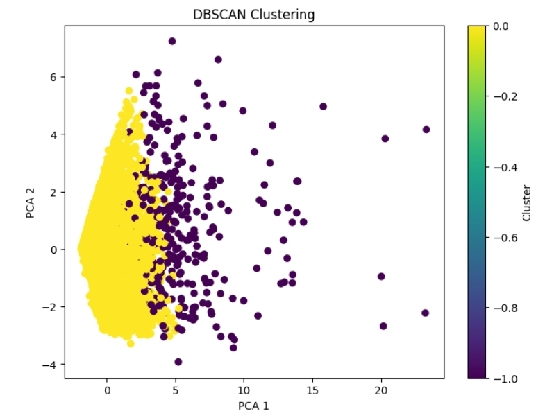
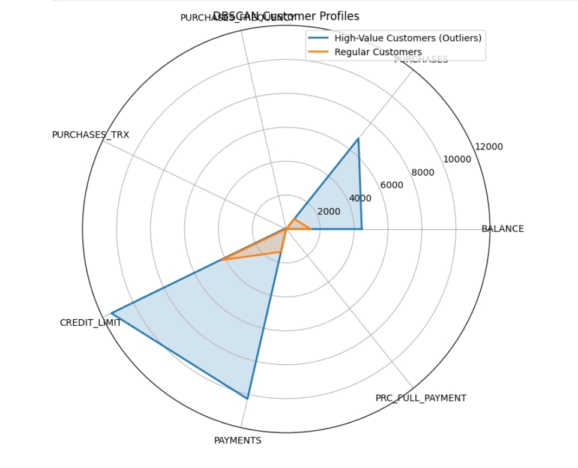

# Credit Card Customer Segmentation with DBSCAN

## Overview

This project uses DBSCAN to segment credit card customers based on their spending and payment behavior. The goal was to identify different customer groups and detect customers whose behavior is significantly different from the majority.

---

## Dataset

The dataset contains information about credit card usage.

### Features Used

- Balance
- Purchases
- Purchase Frequency
- Purchase Transactions
- Credit Limit
- Payments
- Percentage of Full Payments

---

## Data Preprocessing

- Removed missing values.
- Selected the most relevant features.
- Removed engineered percentage features after testing since they didn't improve the results.
- Standardized all features using StandardScaler.

---

## Model

Algorithm: **DBSCAN**

Parameters:

- eps = 1.2
- min_samples = 10

Unlike K-Means, DBSCAN automatically detects clusters and labels unusual observations as outliers.

---

## Results

The model produced two groups:

### Regular Customers

- Average balance
- Average purchases
- Normal payment behavior
- Represents most customers

### High-Value Customers (Outliers)

- Higher balances
- Higher purchases
- Higher credit limits
- Higher payments

Although DBSCAN labels them as outliers, they represent customers with much higher financial activity rather than bad customers.

---

## Visualizations

### DBSCAN Clustering



Customers are projected into two dimensions using PCA. The dense region represents regular customers, while isolated points are detected as outliers.

### Customer Profiles



Radar chart comparing the average values of each feature for both customer groups.

---

## Libraries

- Pandas
- NumPy
- Matplotlib
- Scikit-Learn

---

## Files

```
Credit_Card_Customer_Segmentation/
│
├── credit_card_clustering.ipynb
├── credit_card_cleaned.xlsx
├── Graph/
│   ├── Screenshot_20260802_145458_Chrome.jpg
│   └── Screenshot_20260802_145510_Chrome.jpg
├── requirements.txt
└── README.md
```

---

## Key Takeaways

- Feature selection has a significant impact on clustering quality.
- Scaling is required before applying DBSCAN.
- PCA is useful for visualizing high-dimensional data.
- DBSCAN is effective for detecting unusual customer behavior without specifying the number of clusters.
